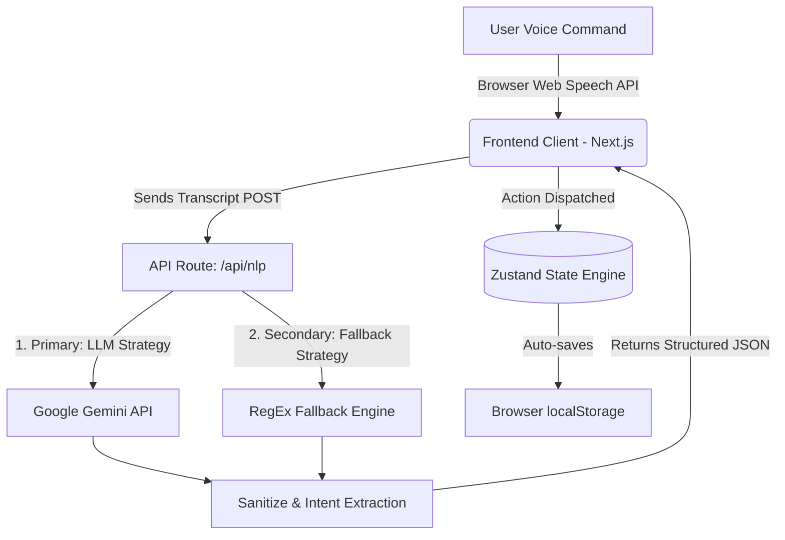

# Shop Assist: Voice-Powered Shopping List

[](https://shop-assist-ten.vercel.app/)

A highly resilient, minimalist, and mobile-first voice command shopping assistant built with **Next.js**, **Tailwind CSS**, and **Zustand**. 

Shop Assist allows users to intuitively manage their grocery shopping lists entirely via natural language voice commands. Whether you are adding multiple quantities of items, removing a specific product, or searching for budget-friendly tiered alternatives, the application processes conversational speech and intelligently manages your cart—all without requiring a database or user authentication.

## Live Demo
Experience the application here: **[https://shop-assist-ten.vercel.app/](https://shop-assist-ten.vercel.app/)**

---

## System Architecture

The application is engineered to be serverless and heavily decoupled. The frontend handles state persistence locally while offloading natural language processing to a specialized Next.js API route. This ensures snappy UI rendering and graceful fallbacks.



## Core Features

- **Advanced Voice Recognition:** Leverages the native browser Web Speech API for seamless transcription without relying on heavy third-party audio packages or external cloud transcription services, reducing latency.
- **Hybrid NLP Engine:** The `/api/nlp` route utilizes **Google Gemini 1.5 Flash** to extract complex semantic intents (Add, Remove, Update, Search, Clear). If the API is rate-limited, times out, or the key is missing, it instantly falls back to a **Rigorous RegEx Parsing Engine**, guaranteeing absolute zero downtime and robust application resilience.
- **Multilingual Support:** Transcribes and successfully translates commands spoken in multiple languages (e.g., Hindi, Spanish) before cleanly mapping them to the proper English categories in the store inventory.
- **Smart Unit Normalization:** Automatically reconciles and merges mathematically complex unit equations (e.g., "add 1kg of apples" followed by "remove 500g of apples" resolves correctly to 500g). It accurately detects base metrics and capacities to prevent illogical merging scenarios.
- **Adversarial Content Filtering:** Equipped with zero-tolerance explicit and adversarial item blockers (covering multiple languages) that violently reject inappropriate requests, ensuring a family-friendly interface. Any rejected items trigger an immediate safety toast alert.
- **Tiered Variant Searching:** Capable of handling search requests mapped to price tiers. For example, dictating "suggest cheap milk" vs "find premium organic milk" effectively filters the product catalog against predefined pricing tiers (budget, standard, premium).
- **Stateless Persistence:** Eliminates the need for Postgres, Firebase, or Supabase. Zustand's `persist` middleware securely retains all data in the user's local browser storage, allowing list continuity across sessions without the friction of account creation.

---

## Technical Use Cases

1. **Hands-Free Operation:** Ideal for users physically cooking or moving through a grocery store who cannot manually type out complex grocery lists.
2. **Offline Resilience:** The integrated offline-capable regex engine provides peace of mind; even in areas with poor internet connectivity where cloud NLP APIs might fail, the application gracefully degrades while retaining functionality.
3. **Smart Alternatives:** Recommends healthier or more affordable substitutes dynamically as users add certain staples to their list.

## Testing & Quality Assurance

Rigorous manual and automated heuristics were developed to handle a vast array of edge cases:
- **Quantity vs. Price Collision:** Ensured that numbers tied to financial constraints (e.g., "under $5") are strictly evaluated as price ceilings rather than inadvertently being extracted as item quantities.
- **Pluralization Standardization:** Commands dictating singular and plural items (e.g., "tomato" vs. "tomatoes") are automatically identified as the same entity via strict trailing suffix manipulation, preventing duplicate list entries.

---

## Setup Instructions

To run this project locally, ensure you have Node.js installed, then follow these standard steps:

1. Clone the repository:
   ```bash
   git clone https://github.com/Varora-24/Shop-Assist.git
   cd Shop-Assist
   ```
2. Install dependencies:
   ```bash
   npm install
   ```
3. Set up environment variables (Optional but highly recommended for full AI capability):
   Create a `.env.local` file in the root directory and add your Google Gemini API key to enable LLM capabilities.
   ```bash
   GEMINI_API_KEY=your_gemini_api_key_here
   ```
   *Note: If omitted, the app will gracefully fall back to the robust offline regex parser seamlessly.*
4. Start the development server:
   ```bash
   npm run dev
   ```
5. Open [http://localhost:3000](http://localhost:3000) in your browser.

---

## Development Approach & Philosophy

My core development approach prioritized absolute application resilience, smooth UX interactions, and a strict adherence to uncompromising technical constraints. I chose **Next.js** for its App Router capability and streamlined API route handling, **Tailwind CSS** for rapid and consistent styling on mobile viewports, and **Zustand** for centralized, prop-drilling-free state management.

By completely separating the UI components from the NLP logic, the application maintains a clean architectural boundary. The addition of defensive programming tactics—like the secondary regex fallback parser, adaptive unit capacity ceilings, and aggressive intent-blocking protocols—ensures that edge cases do not crash the user experience. The ultimate goal was to prove that a lightweight, database-free architecture could securely execute complex AI tasks without compromising speed, responsiveness, or reliability.
