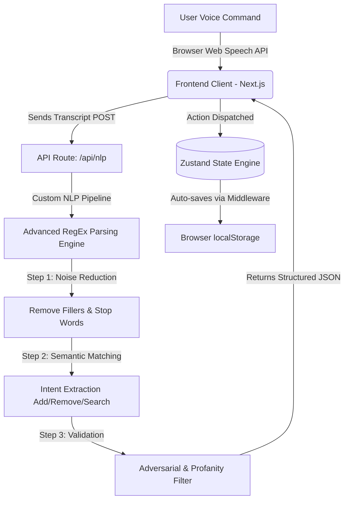

# Shop Assist: Voice-Powered Shopping List

[](https://shop-assist-ten.vercel.app/)

A highly resilient, minimalist, and mobile-first voice command shopping assistant built with **Next.js**, **Tailwind CSS**, and **Zustand**. 

Shop Assist allows users to intuitively manage their grocery shopping lists entirely via natural language voice commands. Whether you are adding multiple quantities of items, removing a specific product, or searching for budget-friendly tiered alternatives, the application processes conversational speech and intelligently manages your cart—all without requiring a database, user authentication, or reliance on expensive third-party LLM cloud services.

## Live Demo
Experience the application here: **[https://shop-assist-ten.vercel.app/](https://shop-assist-ten.vercel.app/)**

---

## System Architecture

The application is engineered to be entirely serverless and heavily decoupled, emphasizing speed, privacy, and local execution. The frontend handles state persistence locally while offloading natural language processing to a specialized Next.js API route housing a sophisticated proprietary Regular Expression (RegEx) engine. This ensures snappy UI rendering, zero API rate-limiting, and an impenetrable offline-capable core.



## Core Features

### 1. Advanced Voice Recognition Integration
Leverages the native browser Web Speech API for seamless transcription without relying on heavy third-party audio packages or external cloud transcription services. By keeping transcription natively in the browser, latency is drastically reduced, ensuring real-time feedback as users speak.

### 2. Proprietary NLP RegEx Engine
Instead of relying on unpredictable and expensive cloud LLMs, the `/api/nlp` route utilizes a custom-built, highly rigorous **RegEx Parsing Engine**. This engine has been meticulously trained to extract complex semantic intents (Add, Remove, Update, Search, Clear) from messy, conversational human speech. It guarantees absolute zero downtime, zero API rate limits, and incredible parsing speed.

### 3. Smart Unit Normalization & Math Reconciler
Automatically reconciles and merges mathematically complex unit equations. For instance, saying "add 1kg of apples" followed by "remove 500g of apples" resolves correctly to 500g. It accurately detects base metrics (grams, liters, dozens) and strictly enforces contextual capacity ceilings (e.g., stopping a user from adding "10,000 kg" of milk, while allowing "10,000 ml"). Incompatible units (like dozens vs liters) are actively detected to prevent data-loss collisions.

### 4. Adversarial Content Filtering
Equipped with a zero-tolerance explicit and adversarial item blocker. It aggressively evaluates transcripts against extensive blacklists containing weapons, inappropriate terms, and multingual profanity (e.g., Hindi expletives). If any inappropriate term is detected, the API immediately halts execution, modifies the intent to `inappropriate`, and fires a red safety toast alert to the user, ensuring a family-friendly interface at all times.

### 5. Tiered Variant Searching
Capable of handling dynamic search requests mapped to product price tiers. For example, dictating "suggest cheap milk" vs "find premium organic milk" effectively isolates the price-modifier adjectives, queries the product catalog, and filters against predefined pricing tiers (budget, standard, premium) while accurately discarding conversational filler.

### 6. Stateless Persistence
Eliminates the need for Postgres, Firebase, or Supabase. Zustand's `persist` middleware securely retains all shopping data in the user's local browser storage. This allows for list continuity across multiple browsing sessions entirely without the friction of account creation, logins, or cloud synchronization.

---

## Technical Use Cases & Scenarios

- **Hands-Free Cooking:** Ideal for users physically cooking in the kitchen who notice they are out of an ingredient. They can simply tap the microphone with a messy hand and dictate their needs without typing.
- **In-Store Navigation:** Users walking through a busy grocery store can rapidly dictate items to remove or update quantities as they place physical items into their cart.
- **Budget Management:** By leveraging the voice-activated variant search, users can quickly find the most affordable version of a staple product (e.g., "find budget bread under $3").
- **Smart Diet Alternatives:** The application dynamically cross-references added items with a substitution dictionary, proactively recommending healthier or vegan alternatives (e.g., suggesting Almond Milk when regular milk is added).

---

## Testing, Quality Assurance & Edge Cases

Rigorous manual and automated heuristics were developed to handle a vast array of NLP edge cases:

1. **Quantity vs. Price Collision:** Ensured that numbers tied to financial constraints (e.g., "under $5") are strictly evaluated as price ceilings rather than inadvertently being extracted as item quantities (e.g., preventing "$5 toothpaste" from adding 5 toothpastes to the list).
2. **Pluralization Standardization:** Commands dictating singular and plural items (e.g., "tomato" vs. "tomatoes") are automatically identified as the same entity via strict trailing suffix manipulation, preventing duplicate list entries and ensuring smooth quantity merging.
3. **Compound Conjunctions:** The engine correctly parses commands linking multiple items (e.g., "add 2 apples, 3 bananas and some milk"), splitting them intelligently on conjunction boundaries and returning an array of independently validated JSON objects.

---

## Setup Instructions

To run this project locally, ensure you have Node.js installed, then follow these standard steps:

1. Clone the repository:
   ```bash
   git clone https://github.com/Varora-24/Shop-Assist.git
   cd Shop-Assist
   ```
2. Install dependencies:
   ```bash
   npm install
   ```
3. Start the development server:
   ```bash
   npm run dev
   ```
4. Open [http://localhost:3000](http://localhost:3000) in your browser. The application requires microphone permissions to utilize the voice command features.

---

## Component Architecture Overview

The frontend is structured into modular, responsibility-driven React components:
- **`VoiceButton.tsx`**: The core interaction hub handling SpeechRecognition lifecycle events, animated mic states, and manual fallback text inputs.
- **`ShoppingList.tsx`**: The primary display component that automatically categorizes groceries (Produce, Dairy, Toiletries) using clean, minimalist cards and handles inline deletions.
- **`SearchPanel.tsx` / `SeasonalPanel.tsx`**: Contextual UI layers that slide into view based on NLP intent, offering interactive filtering or monthly seasonal produce recommendations.
- **`Toasts.tsx`**: A custom, lightweight notification system providing real-time, non-blocking feedback on voice command success or failure.

---

## Development Approach & Philosophy

My core development approach prioritized absolute application resilience, smooth UX interactions, and a strict adherence to uncompromising technical constraints. I chose **Next.js** for its App Router capability and streamlined API route handling, **Tailwind CSS** for rapid and consistent styling on mobile viewports, and **Zustand** for centralized, prop-drilling-free state management.

By completely separating the UI components from the NLP logic, the application maintains a clean architectural boundary. The addition of defensive programming tactics—like the advanced regex parser, adaptive unit capacity ceilings, and aggressive intent-blocking protocols—ensures that edge cases do not crash the user experience. The ultimate goal was to prove that a lightweight, database-free, and LLM-free architecture could securely execute complex natural language tasks without compromising speed, responsiveness, or reliability.
